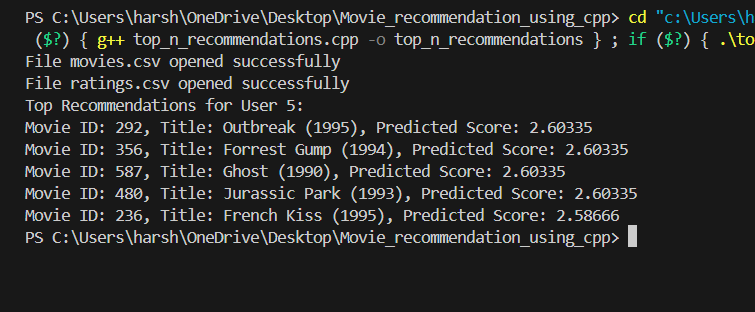
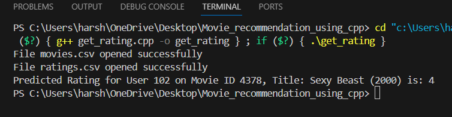
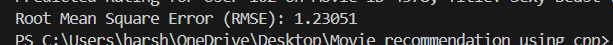
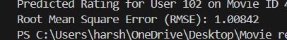

# Movie Recommendation System in C++

## Project Overview

This project implements a **Movie Recommendation System** that predicts top movies 5 for a user and provides a predicted rating for a movie the user has not rated yet, based on similarities with other users. The system uses a **cosine similarity** method to calculate user similarity and a **weighted average** technique to predict ratings.

### Key Features
- **Top 5 Movie Prediction**: Recommend the top 5 movies to a user based on their similarity to other users.
- **Rating Prediction**: Predict the rating a user would give to a movie that they have not yet rated based on ratings from similar users.

---

## How the System Works

### 1. **Predicting Top 5 Movies for a User**

The top 5 movies for a user are predicted based on their **similarity** with other users. Here is how it works:

- **Step 1: User-User Similarity Calculation**
  We compute the similarity between the target user and all other users using the **cosine similarity** measure, which is based on the ratings given by users to the movies. The cosine similarity between two users' rating vectors is calculated as:
  
  \[
  \text{Cosine Similarity} = \frac{\sum{(a_i \cdot b_i)}}{\sqrt{\sum{a_i^2}} \cdot \sqrt{\sum{b_i^2}}}
  \]
  where \( a_i \) and \( b_i \) are the ratings of the two users for movie \(i\).

- **Step 2: Weighting Similarity**
  Once we have the similarity values between the target user and other users, we use the similarity score as a weight to predict ratings for movies that the target user hasn't rated yet.

- **Step 3: Predicting Movie Ratings**
  For each movie that the target user hasn't rated, we compute a **weighted average rating** from the other users. This weighted average is calculated using the ratings from similar users, with higher weights given to more similar users.

- **Step 4: Sorting and Selecting Top 5 Movies**
  After calculating the predicted ratings for all unrated movies, the system sorts them by predicted rating in descending order and selects the top 5 movies to recommend to the user.

### 2. **Predicting the Rating for a Particular Movie**

For a particular movie that a user has not rated yet, the system predicts the rating using the **weighted average method**. Here's how it works:

- **Step 1: Compute Similarities**
  The system computes the cosine similarity between the target user and all other users based on their movie ratings.

- **Step 2: Weighted Rating Calculation**
  The predicted rating for the movie is calculated as the **weighted average** of the ratings from similar users. The weight is the similarity between the target user and each other user. Only users who have rated the movie are considered in the calculation.

- **Step 3: Handle Missing Similarities**
  If there are no similar users (i.e., the similarity sum is zero), the system returns a default rating (in this case, `0.0`).

---

## Project Setup

### Installation Steps
1. Clone the repository:
   ```bash
   git clone https://github.com/yourusername/movie-recommendation-system.git
   ```
   
2. Navigate to the project directory:
   ```bash
   cd movie-recommendation-system
   ```

3. Run the cpp files:
   - top_n_recommendations.cpp -> for getting top 5 predictions (change target user to change user ID for which we want predictions)
   - get_prediction.cpp -> To get a rating for a particular movie for a particular user. (change target user and movie ID to get the required rating)

### Data Format

We have used data from this link - [https://www.kaggle.com/datasets/shubhammehta21/movie-lens-small-latest-dataset]

1. **Movies Data**: The movie dataset contains movie IDs, titles, and tags (optional). Each movie is represented as:
   ```csv
   movie_id, movie_title, movie_tags
   ```

2. **Ratings Data**: The ratings dataset contains user ratings for movies. Each entry represents a rating by a user for a specific movie:
   ```csv
   user_id, movie_id, rating, timestamp
   ```

For using less memory, we have only considered movies up to MovieID = 5000 and not beyond that.

---

## Code Explanation

### 1. **Cosine Similarity Function**

The **cosine similarity** function computes the similarity between two vectors of ratings for users. If either user has a `NaN` value in their ratings, those entries are skipped during the similarity calculation.

### 2. **Prediction Function**

The `predict_rating` function calculates the predicted rating for a particular movie for the target user. It uses the **weighted average** of ratings from other users who have very high similarity to the target user, with the similarity score acting as a weight.

### 3. **Recommendation Function**

The `recommend_movies` function uses the `predict_rating` function to predict the ratings for all movies that the target user hasn't rated yet. It then sorts the movies by predicted rating and returns the top 5 movies.

---

## Performance Report

We evaluated the system by predicting ratings for users who had already rated specific movies and compared the predicted ratings with the actual ones. The Root Mean Squared Error (RMSE) metric was used to measure the accuracy of the predictions:

1. **RMSE for 10 users across all movies**: **1.230**  
2. **RMSE for 100 users for movies with `movieID ≤ 1000`**: **1.008**  

These results demonstrate that the system achieves reasonable accuracy, with better performance observed for a larger user set and a limited movie range.

---

##  Output Screenshots









